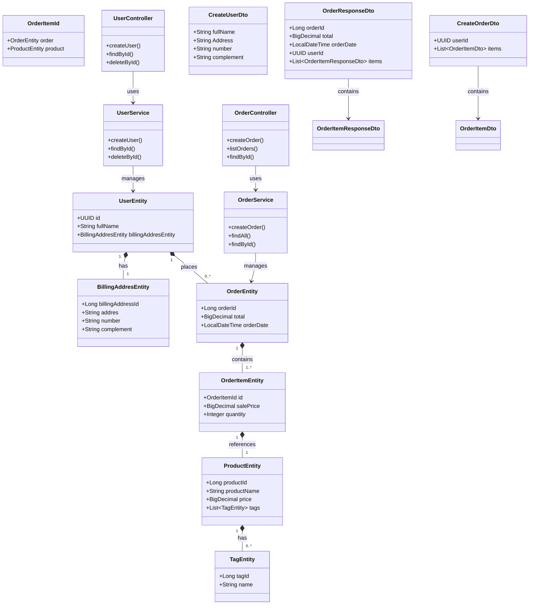

# Sistema de Gerenciamento de Pedidos - E-commerce

## Visão Geral
Sistema backend para gestão de usuários, produtos e pedidos de e-commerce desenvolvido com Spring Boot e Spring Data JPA.

## Estrutura Principal

### Entidades JPA
- **UserEntity**: Usuários com endereço de cobrança (1:1)
- **ProductEntity**: Produtos com tags (N:M)
- **OrderEntity**: Pedidos com itens (1:N)
- **OrderItemEntity**: Itens de pedido (chave composta)
- **TagEntity**: Categorias de produtos
- **BillingAddressEntity**: Endereço de cobrança

### Relacionamentos
1. User 1:1 BillingAddress
2. User 1:N Orders
3. Order 1:N OrderItems
4. Product N:M Tags
5. OrderItem (chave composta Order + Product)

## Camadas da Aplicação

### Controller
- `UserController`: CRUD de usuários
- `OrderController`: Gestão de pedidos

### Service
- `UserService`: Lógica de negócio para usuários
- `OrderService`: Regras de pedidos e cálculos

### Repository
- Interfaces JPA para persistência

## DTOs e Padrões de Resposta
- `CreateUserDto`: Validação de criação de usuário
- `CreateOrderDto`: Estrutura para novos pedidos
- `OrderResponseDto`: Resposta detalhada de pedidos
- `ApiResponse<T>`: Padrão para respostas paginadas

## Features Principais
- Criação de pedidos com validação de estoque
- Cálculo automático de totais
- Paginação em consultas
- Relacionamentos JPA complexos
- Tratamento de erros customizado

## Exemplo de Endpoints

| Método | Endpoint       | Descrição                  |
|--------|----------------|---------------------------|
| POST   | /users         | Cria novo usuário          |
| GET    | /orders        | Lista pedidos paginados    |
| POST   | /orders        | Cria novo pedido           |
| GET    | /orders/{id}   | Detalhes completos do pedido |

## Tecnologias
- Java 21+
- Spring Boot 3
- Spring Data JPA
- Hibernate
- Maven

## Como Executar
```bash

mvn spring-boot:run
```

## 📋 Exemplos de Requisições e Respostas

### **Users Controller**

#### `POST /users` - Criar usuário
**Request:**
```json
{
  "fullName": "Maria Silva",
  "Address": "Av. Paulista, 1000",
  "number": "12B",
  "complement": "Sala 34"
}
```

**Response (201 Created):**
```
Headers:
Location: /users/6ba7b810-9dad-11d1-80b4-00c04fd430c8
```

---

#### `GET /users/{userId}` - Buscar usuário
**Response (200 OK):**
```json
{
  "id": "6ba7b810-9dad-11d1-80b4-00c04fd430c8",
  "fullName": "Maria Silva",
  "billingAddresEntity": {
    "billingAddressId": 1,
    "addres": "Av. Paulista, 1000",
    "number": "12B",
    "complement": "Sala 34"
  }
}
```

---

### **Orders Controller**

#### `POST /orders` - Criar pedido
**Request:**
```json
{
  "userId": "6ba7b810-9dad-11d1-80b4-00c04fd430c8",
  "items": [
    {
      "productId": 5,
      "quantity": 1
    },
    {
      "productId": 8,
      "quantity": 3
    }
  ]
}
```

**Response (201 Created):**
```
Headers:
Location: /orders/42
```

---

#### `GET /orders/{orderId}` - Detalhes do pedido
**Response (200 OK):**
```json
{
  "orderId": 42,
  "total": 359.97,
  "orderDate": "2023-11-20T10:15:30",
  "userId": "6ba7b810-9dad-11d1-80b4-00c04fd430c8",
  "items": [
    {
      "salePrice": 199.99,
      "quantity": 1,
      "product": {
        "productId": 5,
        "productName": "Smart TV",
        "tags": [
          {"tagId": 1, "name": "eletrônico"}
        ]
      }
    },
    {
      "salePrice": 53.33,
      "quantity": 3,
      "product": {
        "productId": 8,
        "productName": "Mouse Gamer",
        "tags": [
          {"tagId": 1, "name": "eletrônico"},
          {"tagId": 3, "name": "periférico"}
        ]
      }
    }
  ]
}
```

---

### **Paginação**
#### `GET /orders?page=0&pageSize=5`
**Response (200 OK):**
```json
{
  "data": [
    {
      "orderId": 42,
      "orderDate": "2023-11-20T10:15:30",
      "total": 359.97
    }
  ],
  "pagination": {
    "page": 0,
    "pageSize": 5,
    "totalElements": 1,
    "totalPage": 1
  }
}
```



